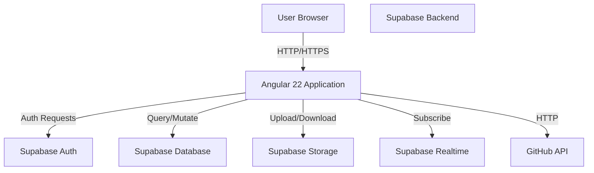

# Design Document: Gaming Platform

## Overview

A full-stack gaming platform built with Angular 22 frontend and Supabase backend. The architecture follows Angular best practices with standalone components, signals for state management, and Supabase for authentication, database, storage, and real-time capabilities. The system provides four distinct games, user profile management, competitive rankings, and global chat with real-time updates.

## Architecture

### High-Level Architecture Diagram



### Application Layer Architecture

- **Presentation Layer**: Angular components with standalone architecture
- **Service Layer**: Data access and business logic services
- **State Management**: Signal-based reactive state
- **API Integration**: Supabase client SDK and HTTP client for external APIs
- **Routing**: Lazy-loaded feature modules with route guards

## Components and Interfaces

### Core Component Hierarchy

```
AppComponent
├── Navigation (global)
├── RouterOutlet
│   ├── LoginComponent
│   ├── RegisterComponent
│   ├── HomeComponent
│   ├── AboutComponent
│   ├── Game1HangmanComponent
│   ├── Game2HigherLowerComponent
│   ├── Game3TriviaComponent
│   ├── Game4BattleshipComponent
│   ├── RankingsComponent
│   └── ChatComponent
└── Footer (global)
```

### Component Descriptions

#### Authentication Components
- **LoginComponent**: Email/username and password input with validation
- **RegisterComponent**: Form for email, name, username, password, birth date, profile photo upload

#### Page Components
- **HomeComponent**: Welcome message, game overview cards
- **AboutComponent**: Developer profile from GitHub API
- **RankingsComponent**: Top 10 players per game in table format
- **ChatComponent**: Real-time message display and input

#### Game Components
- **Game1HangmanComponent**: Letter guessing with on-screen keyboard, timer, visual hangman state
- **Game2HigherLowerComponent**: Card comparison game with lives and timer
- **Game3TriviaComponent**: Multiple choice questions with immediate feedback
- **Game4BattleshipComponent**: Ship placement and tactical gameplay vs AI

#### Global Components
- **NavigationComponent**: Route links, user info, logout button
- **FooterComponent**: Static footer with branding

### Service Architecture

#### Core Services

**AuthService**
- Handles Supabase authentication (login, register, logout)
- Manages auth state signals
- Provides user session information

**UserService**
- Manages user profile data
- Handles profile updates
- Manages user-related queries

**GameResultService**
- Saves game results to respective tables
- Queries game results for rankings
- Filters results by game type

**ChatService**
- Manages chat message persistence
- Subscribes to real-time message updates
- Sends new messages

**RankingsService**
- Queries top 10 results per game
- Orders by performance metrics
- Provides game-specific data

#### Game Services (Optional - if shared logic needed)

**HangmanService**: Word selection, letter processing, state management
**HigherLowerService**: Card deck management, comparison logic
**TriviaService**: Question loading, answer validation
**BattleshipService**: Board initialization, AI logic, ship validation

### Route Guards

**AuthGuard**
- Protects game routes from unauthenticated access
- Redirects to login if not authenticated
- Allows role-based access (regular/admin)

**RoleGuard** (Optional)
- Restricts admin-only routes
- Validates user role before access

## Data Models

### Users Table

```typescript
interface User {
  id: string;                    // UUID from Supabase Auth
  email: string;                 // Unique
  username: string;              // Unique
  name: string;
  surname: string;
  birth_date: string;           // ISO 8601 date format
  profile_photo_url: string;    // URL to Storage bucket
  role: 'regular' | 'admin';    // Default: 'regular'
  created_at: string;           // Timestamp
  updated_at: string;           // Timestamp
}
```

### Hangman Results Table

```typescript
interface HangmanResult {
  id: string;                    // UUID
  username: string;              // FK to users.username
  word: string;
  score: number;                 // Based on time and attempts
  letters_guessed: number;
  incorrect_attempts: number;
  time_taken: number;           // Seconds
  completed: boolean;            // True if word guessed
  created_at: string;           // Timestamp
}
```

### Higher/Lower Results Table

```typescript
interface HigherLowerResult {
  id: string;                    // UUID
  username: string;              // FK to users.username
  score: number;
  consecutive_correct: number;
  final_lives: number;          // 0-3
  time_taken: number;           // Seconds
  game_length: number;          // Number of rounds
  created_at: string;           // Timestamp
}
```

### Trivia Results Table

```typescript
interface TriviaResult {
  id: string;                    // UUID
  username: string;              // FK to users.username
  score: number;
  correct_count: number;        // Out of 20
  incorrect_count: number;      // Out of 20
  time_taken: number;           // Seconds
  category: string;             // Optional: question category
  created_at: string;           // Timestamp
}
```

### Battleship Results Table

```typescript
interface BattleshipResult {
  id: string;                    // UUID
  username: string;              // FK to users.username
  winner: 'player' | 'ai';
  total_turns: number;
  player_hits: number;
  player_misses: number;
  ai_hits: number;
  ai_misses: number;
  time_taken: number;           // Seconds
  created_at: string;           // Timestamp
}
```

### Chat Messages Table

```typescript
interface ChatMessage {
  id: string;                    // UUID
  username: string;              // FK to users.username
  content: string;
  created_at: string;           // Timestamp
}
```

## Security Considerations

### RLS Policies

**Users Table**
- Users can read public profile info (username, name)
- Users can only update their own profile
- Admins can read all user data

**Game Results Tables**
- Users can insert their own results
- Users can read all results (for rankings)
- Users cannot update or delete results

**Chat Messages Table**
- Authenticated users can insert messages
- All authenticated users can read messages
- Users cannot update or delete messages

### Route Guards

- All game routes require authentication via AuthGuard
- Sensitive routes use role-based authorization
- Redirect to login for unauthorized access

## Storage Architecture

### Supabase Storage Buckets

**Profile Photos Bucket**
- Public bucket (read-only)
- Path: `{user_id}/profile.{ext}`
- Allowed formats: jpg, png, webp
- Max size: 5MB

## State Management with Signals

### Global State (to be managed in services using signals)

```typescript
// AuthService
currentUser = signal<User | null>(null);
isAuthenticated = computed(() => this.currentUser() !== null);

// ChatService
messages = signal<ChatMessage[]>([]);

// RankingsService
gameRankings = signal<GameResult[]>([]);
selectedGame = signal<'hangman' | 'higher_lower' | 'trivia' | 'battleship'>('hangman');
```

### Local Component State

Each component manages its own game state using signals for reactivity.

## Error Handling

### Error Categories

1. **Authentication Errors**: Invalid credentials, registration failures
2. **Network Errors**: API failures, timeout
3. **Game Logic Errors**: Invalid moves, rule violations
4. **Storage Errors**: File upload failures, quota exceeded
5. **Database Errors**: RLS violations, data integrity issues

### Error Handling Strategy

- Toast notifications for user-facing errors using Toast.js
- Detailed console logging for development
- User-friendly error messages (non-technical)
- Retry mechanisms for transient failures
- Graceful degradation where possible

## Testing Strategy

### Unit Testing Approach
- Test service methods in isolation
- Mock Supabase client for deterministic tests
- Test component logic with signal updates
- Test form validation rules

### Property-Based Testing
- Generate random valid/invalid inputs for game logic
- Test invariants (e.g., score never negative, board state consistency)
- Test round-trip properties (e.g., data persistence and retrieval)
- Validate RLS policies with random user/data combinations

### Integration Testing
- Test authentication flow end-to-end
- Test game completion and result storage
- Test real-time chat message propagation
- Test rankings calculation

### Test Framework Configuration
- Use Jasmine for unit and integration tests
- Use fast-check for property-based testing
- Configure tests to run minimum 100 iterations for PBT
- Mock Supabase client to avoid test data pollution

## Progressive Web App (PWA) Support

### PWA Features

**Installation**
- Add to home screen capability for iOS and Android
- Installable on Windows and macOS from browser
- Custom app icon and splash screen
- Full-screen standalone mode without browser UI

**Offline Functionality**
- Service Worker caches static assets and API responses
- Core game functionality available offline
- Message sync when connection restored
- Optimistic UI updates for offline actions

**App Shell Architecture**
- Minimal core app shell cached for instant load
- Critical routes pre-cached for offline access
- Network-first strategy for real-time features (chat, rankings)
- Cache-first strategy for static assets

**Web App Manifest**
- `manifest.webmanifest` with app metadata
- Icons for various device sizes and types
- Theme colors matching app branding
- Orientation settings optimized for games

**Service Worker Configuration**
- Angular CLI Service Worker support with Workbox
- Background sync for chat messages when offline
- Push notification support (future enhancement)

## Deployment Architecture

### Frontend Deployment
- Angular build optimized for production with PWA support
- Deployed to Vercel or Netlify with automatic builds
- Environment variables for Supabase connection
- Service Worker cache strategy for offline support

### Backend (Supabase)
- Managed Supabase project
- Database migrations tracked in version control
- RLS policies enforced at database level
- Backups enabled

## Performance Considerations

### Optimization Strategies

1. **Lazy Loading**: Routes loaded on demand
2. **Component Optimization**: OnPush change detection (default in Angular 22)
3. **Image Optimization**: Using NgOptimizedImage for static images
4. **State Efficiency**: Signals for reactive updates without unnecessary re-renders
5. **API Caching**: Cache game rankings and user data appropriately

### Accessibility

- All components meet WCAG AA standards
- Focus management in forms and games
- Color contrast ratios >= 4.5:1
- ARIA labels for interactive elements
- Semantic HTML structure

## Correctness Properties

A property is a characteristic or behavior that should hold true across all valid executions of a system—essentially, a formal statement about what the system should do. Properties serve as the bridge between human-readable specifications and machine-verifiable correctness guarantees.

### Property 1: Authentication Consistency
**For any** valid email/username and password combination stored in the system, attempting to authenticate with those credentials should succeed and return a valid session token.
**Validates: Requirements 1.1**

### Property 2: Unique User Constraints
**For any** two distinct registration attempts with the same email or username, only the first should succeed; the second should be rejected with a constraint violation error.
**Validates: Requirements 2.2, 2.3**

### Property 3: Game Result Persistence Round-Trip
**For any** completed game with valid result data, storing the result and immediately querying it back should return equivalent data.
**Validates: Requirements 6.6, 7.6, 8.4, 9.7**

### Property 4: Rankings Ordering Invariant
**For any** ranking query result, the returned results should be ordered in descending order by the performance metric (score, consecutive_correct, etc.) without exception.
**Validates: Requirements 10.2**

### Property 5: Chat Message Realtime Synchronization
**For any** new message inserted into the chat table, all connected clients subscribed to Realtime updates should receive the new message within 1 second.
**Validates: Requirements 11.3**

### Property 6: RLS Data Isolation
**For any** authenticated user, querying game results should only return results belonging to that user or public ranking data, never other users' private data.
**Validates: Requirements 12.6**

### Property 7: Game State Atomicity
**For any** game completion event, the system should atomically save the game result or fail completely—partial saves should never occur.
**Validates: Requirements 6.6, 7.6, 8.4, 9.7**

### Property 8: User Profile Photo Round-Trip
**For any** uploaded profile photo, retrieving it from Supabase Storage should return binary data equivalent to the original upload.
**Validates: Requirements 2.4**

### Property 9: Navigation Route Protection
**For any** unauthenticated user attempting to access a game route, the system should redirect to login before rendering the game component.
**Validates: Requirements 3.2, Requirements 1.4**

### Property 10: Invalid Form Input Rejection
**For any** form submission with validation errors (empty required fields, invalid email format, duplicate username), the system should reject the submission and display error messages without creating database records.
**Validates: Requirements 2.2, 2.3**
